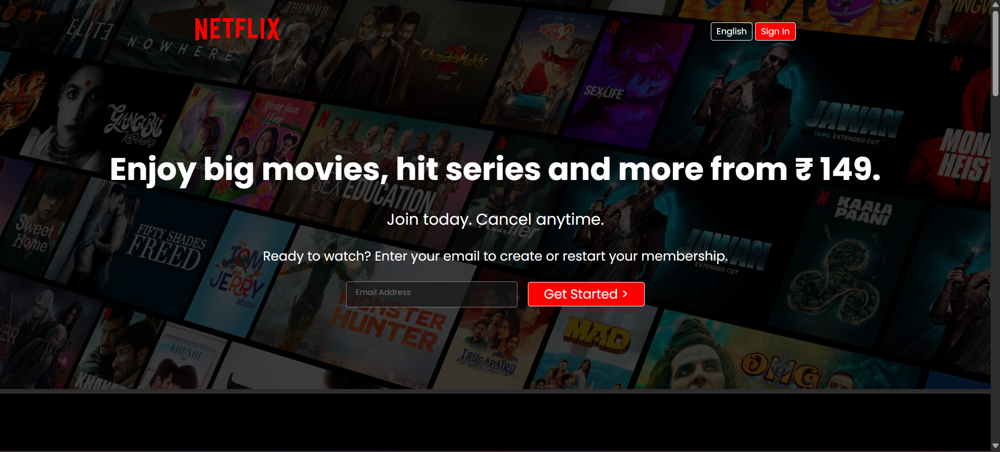

# 🎬 Netflix Landing Page Clone

A responsive front-end clone of the Netflix landing page, built from scratch using pure **HTML5** and **CSS3** — no frameworks, no libraries.

This project was built as part of my web development learning journey to practice real-world layout techniques: Flexbox, responsive design, media queries, and clean semantic structure.

> ⚠️ This is a personal learning project for educational purposes only. Not affiliated with or endorsed by Netflix.
>
> Note: This is a static UI-only demo built for front-end practice. The email signup CTA, Sign In button, language selector, and FAQ interactions are mock interface elements only; they are not connected to any backend, authentication flow, or data submission and do not collect or send user information.

---

## 🔗 Live Preview

**[View Live Site →](https://naitik595.github.io/Netflix-Landing-Page-Clone/)**

---

## 📸 Preview

### Desktop


---

## ✨ Features

- Fully responsive design — adapts across desktop, tablet, and mobile screens
- Hero section with background image overlay and call-to-action
- Alternating content sections with image/video showcases
- "Create profiles for kids" section
- FAQ section layout with hover effect
- Multi-column footer with grid layout, responsive down to 2 columns on smaller screens
- Custom favicon

---

## 🛠️ Built With

- **HTML5** — semantic structure
- **CSS3** — Flexbox, Grid, media queries, transitions
- Google Fonts (Poppins, Martel Sans)

---

## 📂 Project Structure

```
Netflix-Landing-Page-Clone/
├── assets/
│   ├── images/
│   │   ├── bg.jpg
│   │   └── logo.svg
│   └── screenshots/
│       └── hero.png
├── README.md
├── favicon.ico
├── index.html
└── style.css
```

---

## 💡 What I Learned

- Structuring a multi-section landing page with clean, semantic HTML
- Using Flexbox for navigation and content alignment
- Building a responsive footer using CSS Grid
- Working with background images, overlays, and `z-index` layering
- Writing media queries to adapt layouts across screen sizes
- Adding subtle hover transitions for interactive elements
- Controlling native browser video overlays (`controlsList`, `disablePictureInPicture`)

---

## 🚀 Getting Started

Clone the repository and open `index.html` in your browser:

```bash
git clone https://github.com/naitik595/Netflix-Landing-Page-Clone.git
cd Netflix-Landing-Page-Clone
```

Then simply open `index.html`, or use a tool like VS Code's Live Server extension for the best experience.

---

## 🙏 Acknowledgments

Built while following [CodeWithHarry's Sigma Web Development Course](https://youtube.com/playlist?list=PLu0W_9lII9agq5TrH9XLIKQvv0iaF2X3w).

---

**Author:** [Naitik](https://github.com/naitik595)
